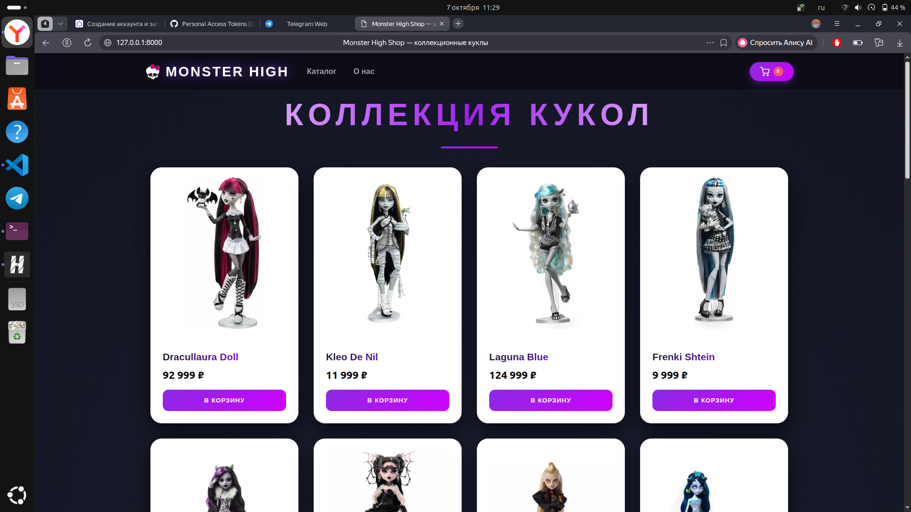

# 🖤 Monster High Shop


Интернет-магазин коллекционных кукол Monster High на Django.


## ✨ Возможности

- 🏠 Главная страница в современном тёмном дизайне
- 🛍 Каталог кукол с карточками товаров
- 🔍 Полноэкранный просмотр картинки по клику на карточку
- 🛒 Полноценная корзина (добавление, изменение количества, удаление)
- 🔗 Ссылки на контакты
- ⚙️ Админ-панель Django: добавление и редактирование карточек без кода

## 🚀 Запуск проекта

```bash
# 1. Клонировать репозиторий
git clone https://github.com/injuse1231/monster-high-shop.git
cd monster-high-shop

# 2. Создать виртуальное окружение и установить зависимости
python3 -m venv venv
source venv/bin/activate
pip install -r requirements.txt

# 3. Применить миграции
python manage.py migrate

# 4. Запустить сервер
python manage.py runserver

Открыть в браузере: http://127.0.0.1:8000

Админка: http://127.0.0.1:8000/admin (создать суперпользователя: python manage.py createsuperuser)

🛠 Стек
Backend: Python, Django
Frontend: HTML, CSS (без фреймворков — чистый адаптивный дизайн)
База данных: SQLite
📌 В планах
👤 Личный кабинет покупателя
💳 Рабочая кнопка «Оформить заказ» с отправкой заявки
📦 Разделение товаров по категориям
Учебный проект. Все права на персонажей Monster High принадлежат Mattel, Inc.
